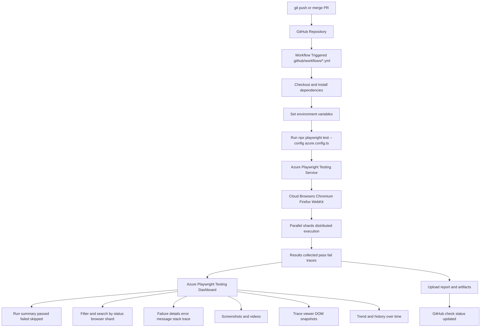

# QA Ops

## What Is QA Ops?

QA Ops (Quality Assurance Operations) is the practice of operating QA as an engineering system, not only as manual test execution.

It combines:

1. Test automation (UI, API, integration).
2. CI/CD pipelines (GitHub Actions, Azure DevOps, Jenkins).
3. Environment and test data management.
4. Reporting, observability, and feedback loops.
5. Governance for quality gates and release decisions.

## Meaning In Simple Words

QA Ops means "running quality like DevOps runs delivery."

Instead of testing only at the end, QA Ops ensures quality checks run continuously from commit to deployment, with fast feedback and traceable reports.

## Why QA Ops Matters

1. Faster feedback on failures.
2. Stable releases with fewer production defects.
3. Standardized execution across browsers/environments.
4. Better visibility with screenshots, traces, logs, and dashboards.
5. Easier scaling through parallel execution and retries.

## QA Ops Flow (Based On Your Diagram)



## QA Ops In This Playwright Project

For this repository, QA Ops means:

1. Trigger test execution from source control events.
2. Run automated tests in CI with deterministic setup.
3. Execute scenarios in parallel for speed.
4. Collect results, traces, screenshots, and HTML reports.
5. Publish status back to pull requests for release confidence.

## Practical QA Ops Commands

```bash
# Run regression tests
npx cucumber-js --tags "@Regression"

# Run with parallel workers
npx cucumber-js --parallel 2

# Retry flaky scenarios once
npx cucumber-js --retry 1

# Generate Cucumber HTML report
npx cucumber-js -f progress -f html:cucumber-report.html

# Open HTML report on Windows
start cucumber-report.html
```

## GitHub First Push Commands

Use these commands for first-time Git setup and push to GitHub.

```bash
# Initialize git repository
git init

# Add all files
git add .

# First commit
git commit -m "first comment"

# Ensure branch name is main
git branch -M main

# Add GitHub remote (replace with your repo URL)
git remote add origin <your-github-repo-url>

# Push to GitHub main branch
git push -u origin main
```

Example remote command:

```bash
git remote add origin "https://github.com/your-username/your-repo.git"
```

## Azure Microsoft Playwright Workspace Setup

This section explains how to use Microsoft Azure Playwright Testing with a free Azure account, create a workspace, connect your local project, enable diagnostics, and run high-scale parallel executions.

## 1) Create Azure Account (Free) And Sign In

1. Go to https://azure.microsoft.com.
2. Select Free account and complete sign-up.
3. Sign in to Azure Portal after account creation.

## 2) Create Playwright Workspace In Azure Portal

1. In Azure Portal search, look for Playwright Testing.
2. Select Create new workspace.
3. Fill in required details:
     - Subscription
     - Resource group
     - Workspace name
     - Region
     - Storage account: create a new one if needed
4. Review and create.
5. After deployment completes, open the resource.
6. Go to Tests or Test runs to view cloud executions.

## 3) Integrate Azure Playwright With Local Project

Install required package and scaffold integration:

```bash
npm init @azure/playwright@latest
```

This setup typically adds project-level configuration and required dependencies.

If needed, install Playwright package in your project:

```bash
npm install -D @playwright/test
```

## 4) Install Azure CLI On Windows

1. Download and install Azure CLI for Windows from Microsoft docs.
2. Restart terminal after installation.
3. Verify installation:

```bash
az version
```

4. Login:

```bash
az login
```

## 5) Add Browser Endpoint To Playwright Setup

Follow Microsoft Azure Playwright instructions and add the generated browser endpoint details into your Playwright service config file (for example, a service config used for Azure runs).

Then run tests with that service config.

## 6) Enable Advanced Diagnostics And Workspace Reporting

1. Enable Playwright workspace reporter in your Azure Playwright config.
2. Configure storage settings in the workspace.
3. If storage is not available, create a storage account.
4. Grant required storage permissions for upload of traces, logs, and artifacts.

## 7) Storage Permission Command (Role Assignment)

Use a role assignment command to grant blob contributor access.

PowerShell one-line format:

```powershell
az role assignment create --assignee "a5730766-84f8-4d8e-bbed-54f85d7ff" --role "Storage Blob Data Contributor" --scope "$(az storage account show --name pwstrgrrd9171 --resource-group rrd --query id -o tsv)"
```

If you prefer multiline in PowerShell:

```powershell
az role assignment create `
    --assignee "a5730766-84f8-4d8e-bbed-54f85d7ff" `
    --role "Storage Blob Data Contributor" `
    --scope "$(az storage account show --name pwstrgrrd9171 --resource-group rrd --query id -o tsv)"
```

## 8) How To Find Required IDs

Find user object ID:

1. In Azure Portal search for Microsoft Entra ID.
2. Go to Users.
3. Open the user and copy Object ID.

Find storage account resource ID:

```bash
az storage account show --name "pwstrgrrd4320" --resource-group "rrd" --query id -o tsv
```

You can also get resource group name from the resource Overview page.

## 9) Run High-Scale Parallel Tests In Azure

Use your Azure service config and increase workers for scale:

```bash
npx playwright test --config=playwright.service.config.js --workers=20
```

After run starts:

1. Workspace reporting enabled message appears in terminal.
2. View run details in Azure Playwright Test runs.
3. Check browser activity logs and execution timeline.
4. Execution happens in cloud browsers managed by Azure.

## 10) Recommended Validation Checklist

1. Azure workspace status is healthy.
2. Storage account linked and permission granted.
3. az login completed from same terminal session.
4. Service config points to Azure endpoint.
5. Parallel run appears under Azure Test runs.

## GitHub Actions + Playwright Introduction

## What Is YAML?

YAML means "YAML Ain't Markup Language".

In GitHub Actions, YAML is the configuration format used to describe automation workflows.

A workflow file tells GitHub:

1. When to run.
2. Where to run.
3. What steps to execute.

## What Is GitHub Actions?

GitHub Actions is CI/CD automation inside GitHub repositories.

When specific repository activity happens, GitHub triggers a workflow and runs jobs on a runner machine.

## Playwright Workflow File

Workflow file location:

` .github/workflows/playwright.yml `

If you choose GitHub Actions during Playwright project creation, this file is generated automatically.
If not generated, you can create it manually.

## How This Workflow Works

Your current workflow in this project is:

```yaml
name: Playwright Tests
on:
    push:
        branches: [ main, master ]
    pull_request:
        branches: [ main, master ]
jobs:
    test:
        timeout-minutes: 60
        runs-on: ubuntu-latest
        steps:
        - uses: actions/checkout@v4
        - uses: actions/setup-node@v4
            with:
                node-version: lts/*
        - name: Install dependencies
            run: npm ci
        - name: Install Playwright Browsers
            run: npx playwright install --with-deps
        - name: Run Playwright tests
            run: npx playwright test
        - uses: actions/upload-artifact@v4
            if: ${{ !cancelled() }}
            with:
                name: playwright-report
                path: playwright-report/
                retention-days: 30
```

## YAML Keys Explained

1. `name`
This is the workflow name shown in GitHub Actions UI.

2. `on`
This defines trigger events.
Your workflow triggers on:
`push` to `main` or `master`
`pull_request` targeting `main` or `master`

3. `jobs`
A workflow contains one or more jobs.
Here the job is named `test`.

4. `runs-on: ubuntu-latest`
This job runs on a Linux GitHub-hosted runner.

5. `steps`
Steps run in order on the same runner within the same job.
Each step is either:
`uses` for a reusable prebuilt action
`run` for a shell command/script

## 6 Steps In This Job

1. `actions/checkout@v4`
Checks out repository code to the runner.

2. `actions/setup-node@v4`
Installs Node.js runtime (`lts/*`).

3. `npm ci`
Installs project dependencies from lock file.

4. `npx playwright install --with-deps`
Installs Playwright browser binaries and required OS deps.

5. `npx playwright test`
Runs all Playwright tests.

6. `actions/upload-artifact@v4`
Uploads `playwright-report/` as artifact and keeps it for 30 days.

## Action vs Shell Script

`uses: ...`
Calls a reusable action published by GitHub or community.

`run: ...`
Executes shell commands directly on the runner.

In this file, checkout/setup/upload are actions, and install/test are shell commands.

## Create Playwright Workflow Manually

If no workflow exists, create this file:

`.github/workflows/playwright.yml`

Then commit and push:

```bash
git add .github/workflows/playwright.yml
git commit -m "Add Playwright GitHub Actions workflow"
git push -u origin main
```

Once pushed, GitHub Actions will start runs on configured events.

## Connect GitHub Pipeline With Azure Cloud

Use this flow when you want GitHub Actions to run Playwright tests in Azure cloud instead of local browser infrastructure.

Replace local-style run command with cloud service config:

```bash
npx playwright test --config=playwright.service.config.js --workers=20
```

## End-To-End Steps

1. Login to Azure from terminal.
2. Create a service principal for GitHub pipeline authentication.
3. Assign required roles to access target resources.
4. Save Azure credentials JSON in GitHub Secrets.
5. Add Azure login action in workflow YAML.
6. Add required environment variables in GitHub Variables.
7. Run workflow and verify test runs in Azure workspace.

## 5 Core Commands (Run In Terminal)

```bash
# 1) Login to Azure
az login

# 2) Create service principal and print credentials JSON
az ad sp create-for-rbac --name "github-playwright" --role "Contributor" --scopes "/subscriptions/<SUBSCRIPTION_ID>/resourceGroups/<RESOURCE_GROUP>" --json-auth

# 3) Get service principal appId for role assignment
az ad sp list --display-name "github-playwright" --query "[0].appId" -o tsv

# 4) Get storage account resource ID
az storage account show --name "<STORAGE_ACCOUNT_NAME>" --resource-group "<RESOURCE_GROUP>" --query id -o tsv

# 5) Assign Storage Blob Data Contributor role
az role assignment create --assignee "$(az ad sp list --display-name 'github-playwright' --query '[0].appId' -o tsv)" --role "Storage Blob Data Contributor" --scope "$(az storage account show --name <STORAGE_ACCOUNT_NAME> --resource-group <RESOURCE_GROUP> --query id -o tsv)"
```

PowerShell multiline role assignment format:

```powershell
az role assignment create `
    --assignee "$(az ad sp list --display-name 'github-playwright' --query '[0].appId' -o tsv)" `
    --role "Storage Blob Data Contributor" `
    --scope "$(az storage account show --name <STORAGE_ACCOUNT_NAME> --resource-group <RESOURCE_GROUP> --query id -o tsv)"
```

## GitHub Secrets And Variables Setup

Go to GitHub repository:

1. Settings.
2. Secrets and variables.
3. Actions.

Create secret:

1. Name: `AZURE_CREDENTIALS`
2. Value: paste full JSON output from `az ad sp create-for-rbac --json-auth`

Create variables (example):

1. `PLAYWRIGHT_SERVICE_URL`
2. `AZURE_REGION`
3. `AZURE_SUBSCRIPTION_ID`

## YAML Update For Azure Login In Same Job

Reference action: `azure/login@v3`

Add this step after dependency/browser install and before test execution:

```yaml
- name: Azure Login
    uses: azure/login@v3
    with:
        creds: ${{ secrets.AZURE_CREDENTIALS }}

- name: Run Playwright tests in Azure cloud
    env:
        PLAYWRIGHT_SERVICE_URL: ${{ vars.PLAYWRIGHT_SERVICE_URL }}
        AZURE_REGION: ${{ vars.AZURE_REGION }}
    run: npx playwright test --config=playwright.service.config.js --workers=20
```

## Example Job Sequence

1. Checkout code.
2. Setup Node.
3. Install dependencies.
4. Install Playwright browsers.
5. Azure login (`azure/login@v3`).
6. Run Playwright cloud test command.
7. Upload report artifact.

## Validate It Is Connected

1. Workflow run in GitHub Actions is green.
2. Azure login step succeeds.
3. Playwright cloud command prints workspace reporting enabled.
4. Azure Playwright workspace shows test runs.
5. Traces/logs/reports are visible in Azure portal.

## Reference YAML (Azure + Playwright)

Use this as a quick copy reference:

```yaml
name: Playwright Tests

on:
    push:
        branches: [ main, master ]
    pull_request:
        branches: [ main, master ]

jobs:
    test:
        timeout-minutes: 60
        runs-on: ubuntu-latest
        steps:
            - uses: actions/checkout@v5
            - uses: actions/setup-node@v5
                with:
                    node-version: lts/*

            - name: Install dependencies
                run: npm ci

            - name: Azure Login
                uses: azure/login@v2
                with:
                    creds: ${{ secrets.AZURE_CREDENTIALS }}

            - name: Run Playwright tests
                env:
                    PLAYWRIGHT_SERVICE_URL: ${{ vars.PLAYWRIGHT_SERVICE_URL }}
                run: npx playwright test --config=playwright.service.config.js --workers=4

            - uses: actions/upload-artifact@v4
                if: ${{ !cancelled() }}
                with:
                    name: playwright-report
                    path: playwright-report/
                    retention-days: 30
```


